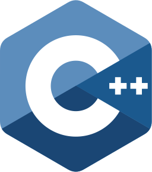
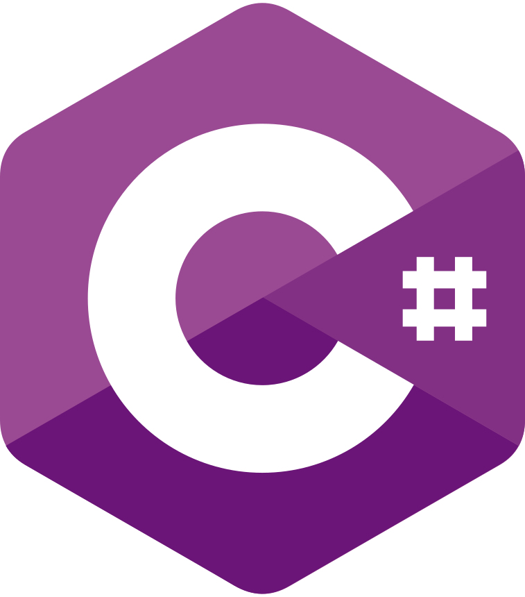
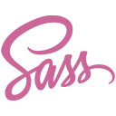

<h1 align="center">Tim Bernhard</h1>

 

<h2 align="center"> 🧑‍🎓 Education </h2>

 
  <strong> Apprenticeship (upcoming) </strong>   
  Schwyzer Kantonalbank  
  starting 08.2023 
   
   
  <strong> Informatikmittelschule (current) </strong>   
  FMZ Lucerne  
  since 08.2020 
   
   
  <strong> Gymnasium (cancelled) </strong>  
  Kollegium Schwyz  
  from 08.2018 to 07.2020

 
 

<h2 align="center"> 🤔 Interests </h2>

  🎧  
  DJ (<a href="https://beatloops.jimdofree.com">Beatloops</a>)     

  📷  
  Photography (<a href="https://unsplash.com/@gummelproductions">Gummelproductions</a>)    

  🚗  
  Car Enthusiast    

<h2 align="center"> 💻 Used Langugages </h2>  

  
  
  
  
  
  
  

 
 

<h2 align="center">💰 Part-time Jobs</h2>

  *every Saturday*

  <strong> 💁 Service Specialist (current) </strong>  
  <a href="https://www.gasthaus-tuebli-gersau.ch/">Gasthaus Tübli</a> 
  || since 06.2022

  <strong> 💁 Service Specialist </strong>  
  <a href="https://www.badi-info.ch/a/brunnen-hopfraeben.html">Badi Hopfräben</a> || from 06.2017 to 07.2022

  <strong> 💁 Service Specialist </strong>  
  <a href="https://www.quai2.ch/">Quai 2</a> || from 08.2018 to 05.2022

